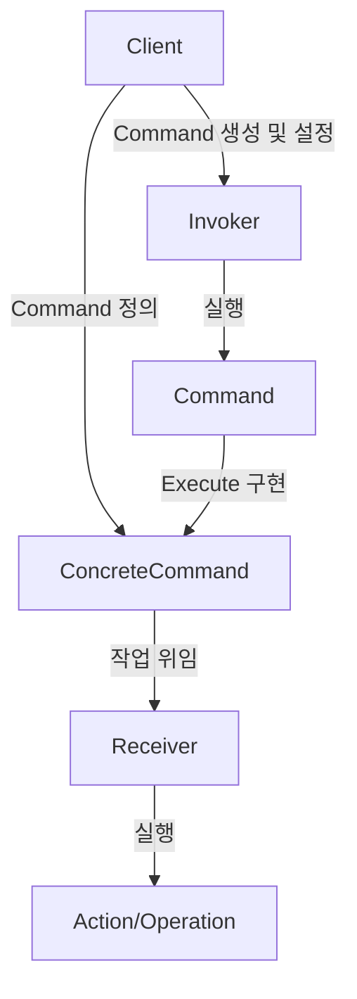

요청을 객체로 캡슐화하여, 실행 주체와 실행 방법을 분리하고 요청의 기록, 취소, 재실행 등의 기능을 유연하게 제공하는 패턴입니다.<br>
이 문서에서는 Command 패턴을 이용하여 캐릭터가 공격 및 점프하는 기능을 구현합니다.
## 구현부
기본적으로 4가지의 객체를 구현합니다.

### Receiver
- Core 로직을 담당하는 구현부
- 컴포넌트를 초기화 및 연결 
```csharp

public class Player : MonoBehaviour
{
    public void Attack(Transform target)
    {
        Debug.Log($"Attack! {target.name}");
    }

    public void Jump()
    {
        Debug.Log("Jump...");
    }
}
```

### Command
- Receiver의 메서드를 호출하는 명령을 정의
- 생성 시 Receiver 객체 필요
```csharp
// 모든 커맨드는 이 인터페이스를 상속받습니다.
public interface ICommand
{
    void Execute();
}

// 데이터 크기가 작은 명령은 struct를 사용합니다.
public readonly struct AttackCommand : ICommand
{
    private readonly Player _player;
    private readonly Transform _target;

    public AttackCommand(Player player, Transform target)
    {
        _player = player;
        _target = target;
    }
    
    public void Execute()
    {
        _player.Attack(_target);
    }
}

public readonly struct JumpCommand : ICommand
{
    private readonly Player _player;

    public JumpCommand(Player player)
    {
        _player = player;
    }
    
    public void Execute()
    {
        _player.Jump();
    }
}

// 자료구조를 쓰거나 데이터가 방대하고 변경될 수 있는 명령은 class를 사용합니다.
public class MultiAttackCommand : ICommand
{
    private Player _player;
    private List<Transform> _monsterTargets;

    public MultiAttackCommand(Player player, List<Transform> monsterTargets)
    {
        _player = player;
        _monsterTargets = monsterTargets;
    }
    
    public void Execute()
    {
        foreach (var monster in _monsterTargets)
        {
            _player.Attack(monster);
        }
    }
}
```

### Invoker
- Command를 실행하는 실행부
- Command를 조합하거나 저장하여 사용
```csharp
// 새로운 Command를 Set한 후 Execute만 담당 
public class InputHandler : MonoBehaviour
{
    private ICommand _currentCommand;

    public void SetCommand(ICommand command)
    {
        _currentCommand = command;
    }

    public void ExecuteCommand()
    {
        _currentCommand?.Execute();
    }
}
```

### Client
- Command들을 선언, Receiver와 Invoker를 캐싱 및 사용

```csharp
public class StartUp : MonoBehaviour
{
[SerializeField] private Player _player;
[SerializeField] private InputHandler _handler;
[SerializeField] private Transform[] _monsters;

    private void Update()
    {
        if (Input.GetKeyDown(KeyCode.A))
        {
            if (_monsters.Length == 0)
            {
                return;
            }
            
            if (_monsters.Length == 1)
            {
                var attackCommand = new AttackCommand(_player, _monsters[0]);
                _handler.SetCommand(attackCommand);    
            }
            else
            {
                var multiAttackCommand = new MultiAttackCommand(_player, _monsters.ToList());
                _handler.SetCommand(multiAttackCommand);    
            }
            
            _handler.ExecuteCommand();
        }
        else if (Input.GetKeyDown(KeyCode.Space))
        {
            var jumpCommand = new JumpCommand(_player);
            _handler.SetCommand(jumpCommand);
            _handler.ExecuteCommand();
        }
    }
}
```