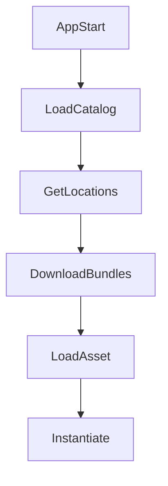

[Addressables Document](https://docs.unity3d.com/Packages/com.unity.addressables@2.3/manual/index.html)

# 왜 쓰는지?

## Resources 방식의 한계
- Resources.Load는 메모리 관리가 불가능, 모든 리소스가 런타임 동작 시 메모리에 올라감.
- 모든 리소스가 빌드에 포함 됨 -> 초기 빌드 사이즈 증가
- 업데이트 시 앱을 재배포 해야 함

## Addressables의 핵심

| 항목        | 의미                                                                                                                           |
|-------------|------------------------------------------------------------------------------------------------------------------------------|
| Lazy Loading | - 필요한 시점에만 리소스를 로드하여 메모리 절약 - DLC형태로 번들별로 나누어 로딩 가능                                                                      |
| Catalog 기반 | - 원격 번들 구조를 메타데이터(Catalog)로 관리 - catalog는 json 형태로 구현되며, Addressables 내부에서 알아서 처리 가능 - 각개의 파일 별로도 버저닝하여 체크 및 다운로드 가능 |
| CDN 연동     | - Firebase, GCS, S3, Cloudflare 등 CDN 사용 가능                                                                                  |

## Addressables의 전체 동작 흐름

| 개념       | 설명                        |
|----------|---------------------------|
| Catalog  | Address -> Bundle 매핑 정보   |
| Bundle   | 실제 Asset들이 모인 Pack 개념의 형태 |
| Provider | 로딩 방식 (Local ? Remote ?)  |

## LoadAsync와 InstantiateAsync

하나의 Prefab을 아래의 방법으로 호출했을 때 ...
### 3.1 LoadAssetAsync vs InstantiateAsync 차이점

| 항목 | LoadAssetAsync | InstantiateAsync |
|--------|------------------|-------------------|
| 반환 타입 | Asset 원본 (Prefab, Sprite, ScriptableObject 등) | Scene에 배치된 GameObject 인스턴스 |
| GameObject 생성 | ❌ 생성 안 함 | ✅ 즉시 생성 |
| 의존성 로딩 | ✅ 관련 번들 로드 | ✅ 관련 번들 로드 |
| 실제 사용 가능 시점 | Asset 참조만 가능, Instantiate 필요 | 바로 활성 상태로 사용 가능 |
| 메모리 사용 | Asset 메모리만 점유 | Asset + Instance 메모리 점유 |
| Pooling 연계 | 직접 Instantiate + Pool 구성 필요 | Instance를 그대로 Pool에 반환 가능 |
| 재사용 전략 | 동일 Asset 여러 번 Instantiate 가능 | Instance 재사용이 일반적 |
| Release 대상 | Asset Handle 해제 | Instance + Asset Handle 관리 필요 |
| Addressables.Release | Asset 수명 관리 중심 | Instance 반환 후 ReleaseInstance 필요 |
| 대량 생성 성능 | Instantiate 비용 발생 | 동일 (내부적으로 Instantiate 수행) |
| UI / Popup 사용 적합성 | ❌ 번거로움 | ✅ 매우 적합 |
| Data Asset 사용 | ✅ ScriptableObject, Config 로딩에 적합 | ❌ 부적합 |
| 실수하기 쉬운 점 | Asset만 Release하고 Instance 참조 남김 | Pool에 넣어두고 Handle Release하면 터짐 |
