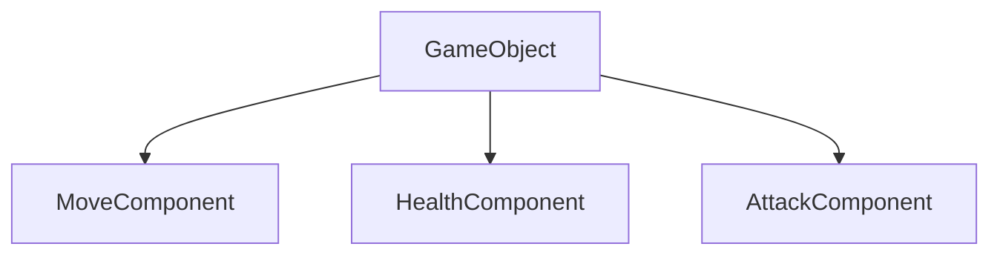
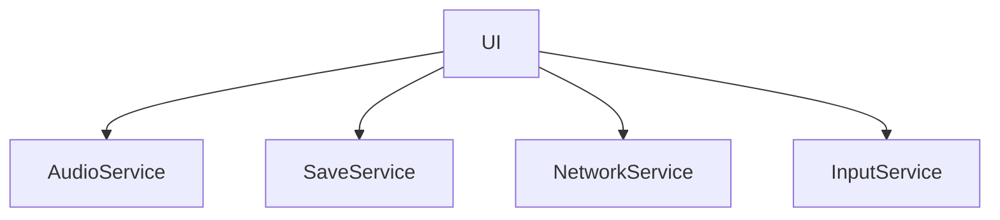
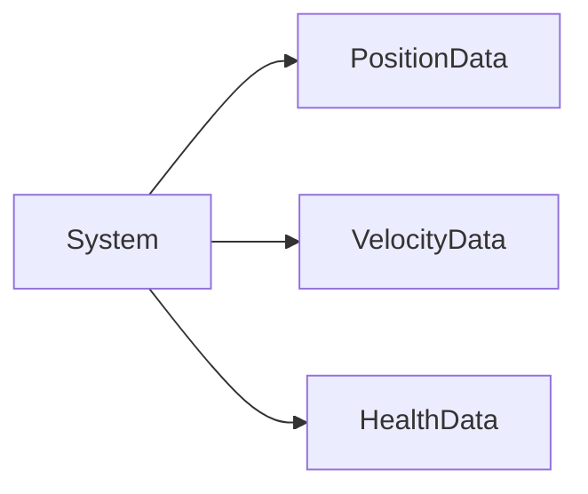
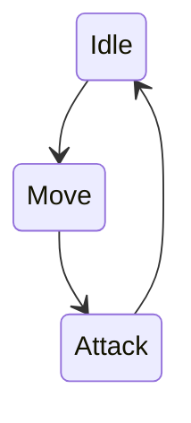
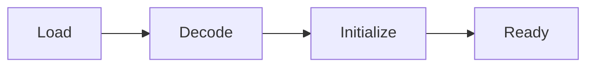
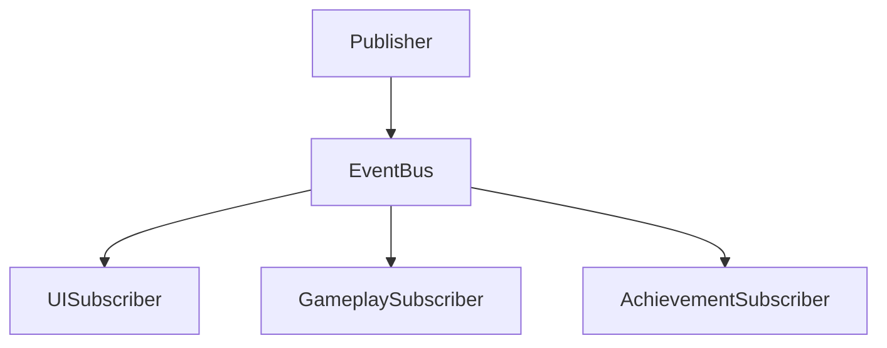
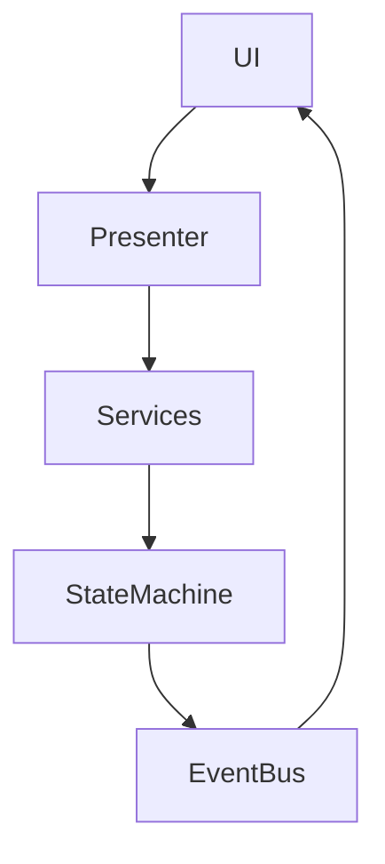

---
title: Unity-Oriented Architectural Styles
sidebar:
  order: 18
---

이 문서는 Layered, Clean, Hexagonal, MVC 계열 외에  
Unity 프로젝트에서 실제로 자주 사용되는 추가적인 아키텍처 스타일을 정리한다.

목표는  
각 구조를 Unity에서 사용했을 때 어떤 느낌으로 체감되는지를 설명하는 것이다.

---

## 1. Component-Based Architecture

### 개요
기능을 상속 계층이 아니라 컴포넌트 단위로 분해하여 조합하는 구조다.  
Unity의 GameObject와 MonoBehaviour 모델 자체가 이 방식을 따른다.

### 핵심 사고
- 객체는 하나의 책임만 가진다
- 기능은 상속이 아니라 조합으로 확장한다
- 컴포넌트는 가능한 한 독립적으로 유지한다

### Unity에서의 느낌
- 가장 기본적이고 자연스러운 구조
- 소규모 프로젝트에서 생산성이 매우 높다
- 규모가 커질수록 컴포넌트 간 의존성 추적이 어려워진다
- 어디서 값이 변경되는지 추적하기 힘들어질 수 있다

### 주의점
- 컴포넌트 간 직접 참조가 늘어나면 결합도가 급격히 증가한다
- 이벤트나 상위 조정자 개념이 필요해진다

---

## 2. Service-Oriented Architecture (Local SOA)

### 개요
게임 전역에서 사용하는 기능을 Service 단위로 분리하는 구조다.

예시:
- AudioService
- SaveService
- NetworkService
- InputService

### 핵심 사고
- 서비스는 전역 기능을 담당한다
- 서비스는 가능한 한 상태를 적게 가진다

### Unity에서의 느낌
- GameManager가 비대해지기 시작하면 자연스럽게 등장한다
- DI 프레임워크(VContainer, Zenject)와 궁합이 좋다
- 서비스 간 의존성 규율이 구조의 품질을 좌우한다

### 주의점
- 서비스가 서로를 직접 참조하기 시작하면 구조가 빠르게 망가진다
- 인터페이스 기반 설계가 중요하다

---

## 3. Data-Oriented Architecture (DOD / ECS)

### 개요
객체 중심이 아니라 데이터 배치와 접근 패턴을 중심으로 설계하는 방식이다.

### 핵심 질문
객체가 무엇을 하느냐보다  
데이터가 어떻게 배열되고 순회되는가를 먼저 고민한다.

### Unity에서의 느낌
- DOTS, ECS, Job System, Burst와 함께 사용된다
- 성능은 매우 뛰어나다
- 진입 장벽이 높고 디버깅 난이도가 높다
- 일반적인 게임 로직에는 과한 경우가 많다

### 적합한 경우
- 대량의 동일한 연산
- 명확한 CPU 병목 구간
- 프레임 단위 성능이 중요한 시스템

---

## 4. State Machine Architecture

### 개요
시스템을 명확한 상태(State)와  
상태 간 전이(Transition)로 표현하는 구조다.

### 핵심 사고
- 현재 상태가 가능한 행동을 결정한다
- 상태 전이는 명시적으로 관리한다

### Unity에서의 느낌
- 캐릭터 행동 로직
- UI 흐름 제어
- 게임 페이즈 관리에 매우 자주 사용된다
- 로직 흐름이 눈에 잘 들어온다

### 주의점
- 상태 수가 늘어나면 관리 비용이 급격히 증가한다
- 계층형 상태 설계가 필요해질 수 있다

---

## 5. Pipeline / Flow-Based Architecture

### 개요
처리를 단계(Stage)로 나누고  
데이터가 정해진 흐름을 따라 이동하도록 만드는 구조다.

### 핵심 사고
- 처리 순서를 구조로 고정한다
- 각 단계는 독립적으로 테스트 가능해야 한다

### Unity에서의 느낌
- 로딩 파이프라인
- 리소스 처리
- Addressables Preload
- 에디터 툴 처리 흐름에 자주 사용된다

### 장점
- 흐름이 명확하다
- 비동기 및 병렬 확장이 쉽다

---

## 6. Message Bus / Pub-Sub Architecture

### 개요
객체들이 서로 직접 참조하지 않고  
메시지 또는 이벤트를 통해 통신하는 구조다.

### 핵심 사고
- 누가 처리하는지는 중요하지 않다
- 무엇이 발생했는지만 전달한다

### Unity에서의 느낌
- UI 갱신
- 게임 이벤트 처리
- 업적 및 퀘스트 시스템
- EventBus, PubSub 패턴으로 구현된다

### 주의점
- 흐름 추적이 어렵다
- 디버깅 난이도가 높아진다
- 이벤트 남용 시 구조 파악이 힘들어진다

---

## Unity 기준 종합 정리

Unity 프로젝트에서  
단 하나의 아키텍처만 사용하는 경우는 거의 없다.

현실적인 조합 예시는 다음과 같다.
- 전체 구조: Clean 또는 Layered
- 오브젝트 구성: Component-Based
- 전역 기능: Service-Oriented
- 흐름 제어: State Machine
- 이벤트 처리: Message Bus
- 성능 병목 구간: Data-Oriented

중요한 것은 구조의 이름이 아니라  
왜 이 구조를 선택했는지를 설명할 수 있는가이다.

---

## 최종 한 줄 정리

Unity 아키텍처는  
정답을 고르는 문제가 아니라  
상황에 맞게 조합하는 문제다.
