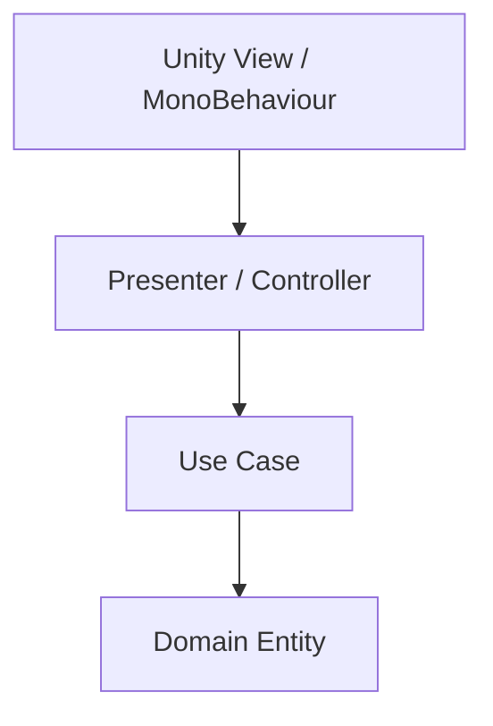

---
title: Clean Architecture
sidebar:
  order: 16
---

## 개요
Clean Architecture는 비즈니스 규칙을 중심에 두고
변경 가능성이 높은 요소를 바깥으로 밀어내는 구조다.

핵심 규칙은 다음과 같다.
의존성은 항상 안쪽을 향한다.

## 구성 요소
- Entities: 핵심 비즈니스 규칙
- Use Cases: 애플리케이션 로직
- Interface Adapters: 데이터 변환 계층
- Frameworks & Drivers: UI, DB, Network

## 장점
- 테스트가 쉽다
- 장기 유지보수에 강하다
- 외부 기술 교체 비용이 낮다
- 도메인 중심 설계가 가능하다

## 단점
- 초기 설계 비용이 크다
- 구조가 복잡해질 수 있다
- 소규모 프로젝트에는 과할 수 있다

## 언제 적합한가
- 장기 운영 프로젝트
- 비즈니스 규칙이 복잡한 경우
- 테스트 자동화가 중요한 경우
- 플랫폼 교체 가능성이 있는 경우

## 정리
Clean Architecture는 지금 편한 구조가 아니라
나중에 살아남는 구조를 만든다.

## Unity 감각 요약
- MonoBehaviour는 입력 + 출력만
- 테스트 코드에서 Unity 참조 ❌
- “이 로직을 콘솔 앱에서도 돌릴 수 있나?” → YES
- Unity는 맨 바깥 껍데기
  - 핵심 로직은 Unity 없이도 돌아가는 순수 C#