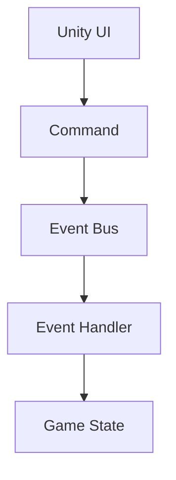

---
title: CQRS and Event Driven Architecture
sidebar:
  order: 17
---

## CQRS

CQRS는 쓰기와 읽기를 분리하는 패턴이다.

- Command: 상태 변경
- Query: 조회 전용

### 장점
- 읽기와 쓰기 최적화 분리
- 복잡한 도메인 표현 가능
- 확장성 향상

### 단점
- 구조 복잡도 증가
- 데이터 동기화 문제
- 작은 시스템에는 과함

## Event Driven Architecture

시스템 구성 요소들이
이벤트를 발행하고 구독하는 구조다.

### 장점
- 느슨한 결합
- 확장성 우수
- 비동기 처리에 강함

### 단점
- 흐름 추적이 어렵다
- 디버깅 난이도가 높다
- 이벤트 폭증 위험

## 언제 등장하는가
- 시스템 규모가 커질 때
- 서비스가 분리될 때
- 도메인 복잡도가 높아질 때

## 정리
CQRS와 Event Driven Architecture는
처음부터 쓰는 구조가 아니라
복잡도가 임계점을 넘었을 때의 선택지다.

## Unity 감각 요약
- 버튼 클릭 → Command
- 상태 변경 → Event
- UI는 이벤트 구독
- 확장성은 최고, 추적 난이도도 최고