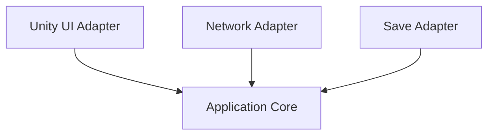

---
title: Hexagonal Architecture
sidebar:
  order: 16
---

## 개요
Hexagonal Architecture는 애플리케이션 코어를
외부 세계로부터 완전히 분리하는 구조다.

핵심 개념은 다음과 같다.
- Port: 코어가 정의한 인터페이스
- Adapter: 외부 시스템과의 연결 구현체

## 핵심 원칙
- 코어는 UI를 모른다
- 코어는 DB를 모른다
- 코어는 네트워크를 모른다

## 장점
- 외부 시스템 교체가 매우 쉽다
- 테스트 시 Fake Adapter 사용 가능
- 기술 변화에 강하다

## 단점
- 인터페이스 수가 많아진다
- 설계 난이도가 높다
- 작은 프로젝트에는 과하다

## Clean Architecture와의 관계
철학은 유사하며
Hexagonal Architecture는 입출력 경계에 더 집중한다.

## 정리
Hexagonal Architecture는
애플리케이션이 외부 세계와 직접 대화하지 않도록 강제한다.

## Unity 감각 요약
- Core는 MonoBehaviour를 모름
- 테스트 시:
  - Unity Adapter ❌
  - Fake Adapter ⭕
  - 플랫폼 교체에 매우 강함