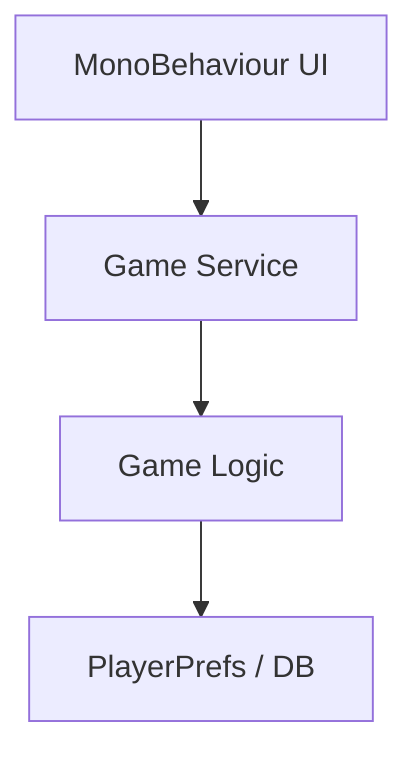

---
title: Layered Architecture
sidebar:
  order: 15
---

## 개요
Layered Architecture는 시스템을 역할별 계층(Layer)으로 나누는 전통적인 구조다.

일반적인 계층 구성은 다음과 같다.
- Presentation (UI)
- Application / Service
- Domain / Business
- Infrastructure (DB, Network)

각 계층은 원칙적으로 바로 아래 계층에만 의존해야 한다.

## 장점
- 구조가 단순하고 직관적이다
- 학습 비용이 낮다
- 소규모 프로젝트에 적합하다
- 팀 온보딩이 빠르다

## 단점
의존성 방향이 쉽게 무너진다.

상위 계층이 하위 계층의 구현을 직접 참조하기 시작하면
Domain이 DB나 Framework를 알게 되고 구조가 붕괴된다.

## 언제 문제가 되는가
- 프로젝트 규모가 커질 때
- 테스트 작성이 필요해질 때
- DB, 네트워크, UI 교체 요구가 생길 때

## 정리
Layered Architecture는 시작하기엔 좋지만
의존성 규율을 강하게 지키지 않으면 유지보수 비용이 급격히 증가한다.

## Unity 감각 요약

- 초반: 빠르고 직관적
- 중반 이후:
  - Domain에서 Debug.Log
  - Service에서 MonoBehaviour 참조
  - 의존성 규율이 무너지기 쉬움