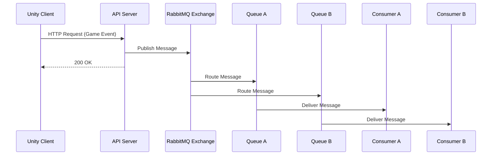

---
title: Kafka
sidebar:
  order: 44
---

Kafka는  
대규모 이벤트 스트리밍을 위한 분산 로그 시스템이다.

메시지 큐라기보다는  
"이벤트 저장소"에 가깝다.

---

## 1. Kafka의 핵심 개념

- Topic 기반 이벤트 스트림
- 메시지는 삭제되지 않고 보존됨
- Consumer가 원하는 시점부터 읽음
- 매우 높은 처리량

---

## 2. Unity에서의 전형적인 구조

Game Server / API Server  
→ Kafka Topic  
→ Multiple Consumers

Unity 클라이언트는  
직접 Kafka를 사용하지 않는다.

---

## 3. Kafka의 특징

- 초당 수십만 이벤트 처리
- 이벤트 재처리 가능
- 대규모 로그/통계 처리에 특화

---

## 4. Unity 실무 사용 예시

- 플레이 로그 수집
- 게임 행동 분석
- 데이터 파이프라인
- 운영 지표 수집

---

## 5. Unity 기준 장단점

### 장점
- 확장성 매우 뛰어남
- 이벤트 재생 가능
- 데이터 분석에 최적

### 단점
- 운영 난이도 매우 높음
- 실시간 처리에는 과함
- 모바일 게임 단독 사용은 드묾

---

## 6. 한 줄 요약

Kafka는  
Unity 게임의 대규모 로그와 분석 파이프라인에 쓰인다.

## 흐름

- 의미
  - 이벤트는 “소비”가 아니라 “기록”
  - 여러 Consumer가 같은 데이터를 각자 처리
  - 리플레이 가능
  - “대규모 로그 / 분석 파이프라인”