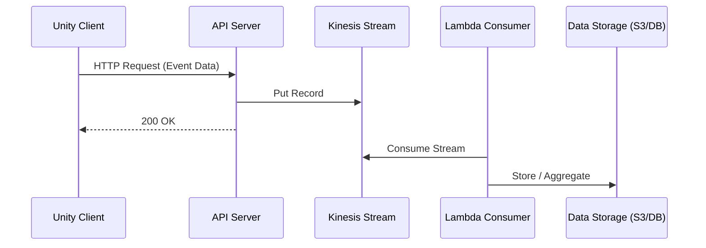

---
title: Kinesis
sidebar:
  order: 45
---

Kinesis는  
AWS에서 제공하는 관리형 스트리밍 서비스다.

Kafka의 관리형 대안에 가깝다.

---

## 1. Kinesis의 핵심 개념

- 스트림 기반 이벤트 처리
- Shard 단위 확장
- 실시간 데이터 수집 및 처리

---

## 2. Unity에서의 전형적인 구조

Game Server / API Server  
→ Kinesis Stream  
→ Consumer(Lambda, Analytics, Firehose)

Unity는 보통  
직접 접근하지 않는다.

---

## 3. Kinesis의 특징

- 실시간 스트림 처리
- AWS 서비스와 강력한 연동
- 서버리스 분석 파이프라인 구성 가능

---

## 4. Unity 실무 사용 예시

- 실시간 플레이 로그 수집
- 이벤트 기반 통계
- 실시간 대시보드 데이터
- 로그 → S3 자동 적재

---

## 5. Unity 기준 장단점

### 장점
- 운영 부담 낮음
- AWS 생태계와 통합 쉬움
- 실시간 처리 가능

### 단점
- AWS 종속
- Kafka 대비 유연성 낮음
- 비용 구조 이해 필요

---

## 6. 한 줄 요약

Kinesis는  
Unity 게임의 실시간 이벤트 수집을 AWS에서 쉽게 처리하는 선택지다.

## 흐름

- 의미
  - Kafka와 유사한 스트림 구조
  - AWS 관리형
  - 실시간 처리 + 저장 파이프라인
  - “AWS 친화적인 실시간 스트리밍”