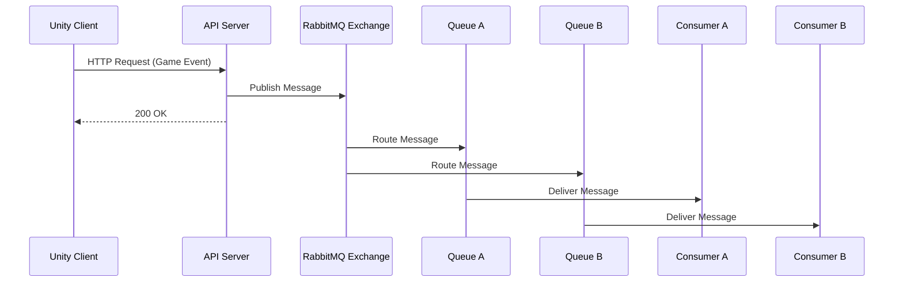

---
title: Rabbit MQ
sidebar:
  order: 43
---

RabbitMQ는  
AMQP 기반의 메시지 브로커다.

큐뿐 아니라  
라우팅, 브로드캐스트, 토픽 기반 전달이 가능하다.

---

## 1. RabbitMQ의 핵심 개념

- Message Broker
- Exchange → Queue 구조
- 다양한 전달 방식 지원
    - Direct
    - Fanout
    - Topic

---

## 2. Unity에서의 전형적인 구조

Unity Client  
→ API Server  
→ RabbitMQ  
→ Multiple Consumers

Unity는 직접 연결하지 않고  
항상 서버를 통해 메시지를 발행한다.

---

## 3. RabbitMQ의 특징

- 메시지 라우팅 유연
- 다양한 소비자 패턴
- ACK 기반 처리 보장
- 실시간에 가까운 처리 가능

---

## 4. Unity 실무 사용 예시

- 채팅 메시지 전달
- 게임 이벤트 브로드캐스트
- 서버 간 이벤트 전달
- 실시간 알림 처리

---

## 5. Unity 기준 장단점

### 장점
- 유연한 메시지 분배
- 낮은 지연 시간
- 다양한 패턴 지원

### 단점
- 직접 운영 필요
- 스케일링/클러스터링 부담
- 관리 난이도 높음

---

## 6. 한 줄 요약

RabbitMQ는  
Unity 서버 구조에서 복잡한 이벤트 라우팅에 강하다.

## 흐름

- 의미
  - 하나의 이벤트를 여러 소비자가 처리
  - 채팅, 알림, 이벤트 브로드캐스트에 적합
  - “실시간 이벤트 분배”