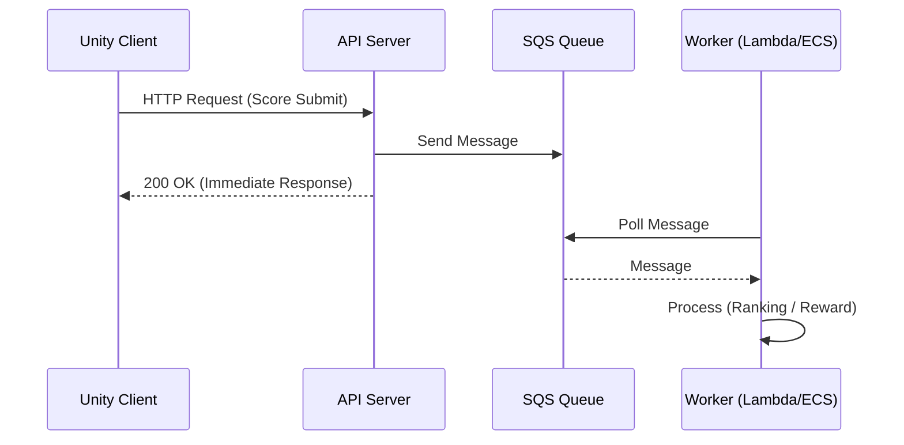

---
title: SQS
sidebar:
  order: 42
---

SQS(Simple Queue Service)는  
AWS에서 제공하는 관리형 메시지 큐다.

메시지를 큐에 넣고,  
워커가 하나씩 꺼내 처리하는 구조다.

---

## 1. SQS의 핵심 개념

- Queue 기반 메시징
- Producer와 Consumer 완전 분리
- Pull 방식(Consumer가 메시지를 가져감)
- 완전 관리형 서비스

---

## 2. Unity에서의 전형적인 구조

Unity Client 또는 API Server  
→ SQS Queue  
→ Worker(Server, Lambda, ECS 등)

Unity는 보통  
직접 SQS에 넣기보다는  
API 서버를 통해 메시지를 생성한다.

---

## 3. SQS의 특징

- 메시지 순서 보장 옵션(FIFO Queue)
- 중복 처리 방지 기능
- 메시지 재시도 자동 지원
- 처리 실패 시 재전송 가능

---

## 4. Unity 실무 사용 예시

- 점수 제출 후 랭킹 집계 요청
- 결제 완료 후 보상 지급 작업
- 게임 로그 비동기 저장
- 푸시 알림 요청

---

## 5. Unity 기준 장단점

### 장점
- 설정이 단순
- 운영 부담 거의 없음
- AWS 생태계와 자연스럽게 연동

### 단점
- 메시지 처리 지연 가능
- 실시간 처리에는 부적합
- AWS 종속성

---

## 6. 한 줄 요약

SQS는  
Unity 백엔드에서 가장 단순하고 안전한 비동기 큐다.

## 흐름

- 의미
  - Unity는 결과를 기다리지 않음
  - API 서버는 큐에 넣고 바로 응답
  - 워커가 비동기로 처리
  - “안전하고 단순한 비동기 처리”