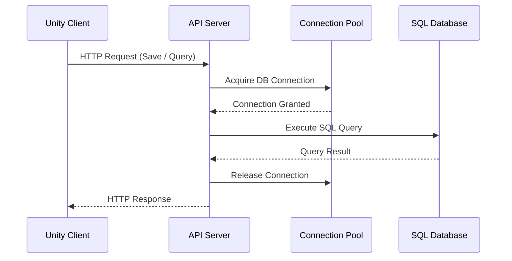
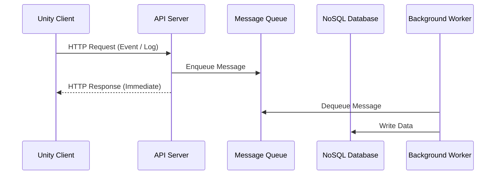
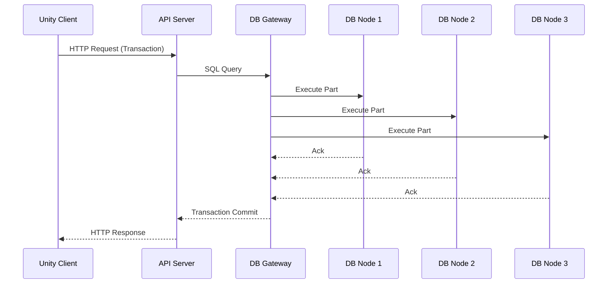
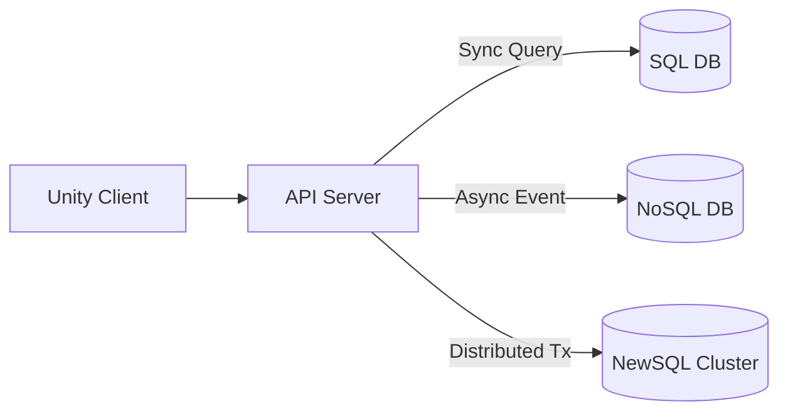

---
title: Flow
sidebar:
  order: 47
---

## SQL

### 해석 포인트

- 요청 하나가 DB 트랜잭션 종료까지 동기적으로 대기
- 커넥션 점유 시간이 길어질 수 있음
- 요청 수보다 동시 연결 수가 병목이 됨
- 정확성과 일관성이 최우선인 구조

## NoSQL

### 해석 포인트

- Unity 요청은 DB 처리 완료를 기다리지 않음 
- 빠른 응답, 높은 처리량
- Eventual Consistency 허용
- 로그, 이벤트, 통계, 랭킹 스냅샷에 적합

## NewSQL

### 해석 포인트

- Unity/서버는 SQL DB처럼 사용
- 내부적으로는 분산 노드에서 처리
- 동기 트랜잭션 + 수평 확장
- 글로벌 서비스, 고가용성 환경에 적합

## 세가지 흐름 비교

## 핵심 요약 (Unity 관점)

### SQL
- 정확함
- 동기 처리
- 연결 수가 병목

### NoSQL
- 빠름
- 비동기 처리
- 요청 수에 강함

### NewSQL
- 정확 + 확장
- 내부 복잡성은 DB가 감춤
- 비용과 운영 난이도 ↑