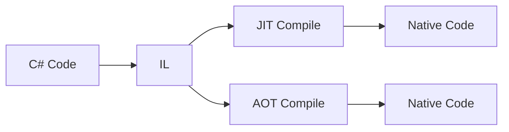

---
title: CLR / JIT / AOT
sidebar:
  order: 7
---

> 빌드 시간 · 실행 시간 · 메모리 사용량 사이의 트레이드오프

Unity 개발자에게 이 주제는 **왜 에디터에서는 잘 되는데 모바일 빌드는 다르게 느껴지는가**를 설명하는 핵심이다.

---

## 기본 개념 정리

* **CLR (Common Language Runtime)**
  .NET 코드의 실행 환경. GC, 타입 시스템, 예외 처리, 스레딩 모델을 제공한다.

* **JIT (Just-In-Time)**
  실행 시점에 IL 코드를 네이티브 코드로 변환한다.

* **AOT (Ahead-Of-Time)**
  빌드 시점에 미리 네이티브 코드로 변환한다. (Unity: IL2CPP)

---

## 실행 흐름 비교 (Unity 관점)

---

## Unity에서의 트레이드오프

| 구분    | JIT (Editor/Mono) | AOT (IL2CPP) |
| ----- | ----------------- | ------------ |
| 빌드 시간 | 빠름                | 느림           |
| 실행 시간 | 초기 느림 → 점점 최적화    | 비교적 안정적      |
| 메모리   | JIT 캐시 사용         | 코드 크기 증가 가능  |
| 제약    | 적음                | 리플렉션/제네릭 제한  |

---

## 대화용 한 문장

> "에디터에서는 JIT 기반이라 유연하지만, 모바일에서는 AOT라서 빌드 시간과 제약을 감수하는 대신 실행 안정성을 얻습니다."
