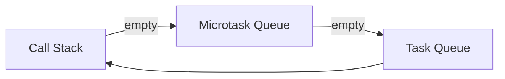

---
title: Event Loop
---

> 비동기 코드 순서를 설명할 수 있는가

Unity 개발자에게 이벤트 루프는 **메인 루프의 또 다른 형태**다. (node.js)

---

## 구성 요소

* Call Stack
* Microtask Queue (Promise)
* Task Queue (setTimeout 등)

---

## 실행 우선순위

1. Call Stack
2. Microtask 전부 처리
3. Macro Task 하나 처리

---

## Unity 대응 개념

* 메인 스레드 루프
* 프레임 종료 콜백
* 메시지 큐 처리

---

## 대화용 한 문장

> "JS는 이벤트 루프를 통해 싱글 스레드에서도 실행 순서를 제어합니다."
