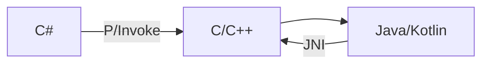

---
title: Native Interop
---
> 엔진 / 플랫폼 이야기로 넘어갈 때 필수

Unity는 관리 코드(C#)와 네이티브 코드(C/C++) 사이를 오가는 엔진이다. (P/Invoke, JNI)

---

## 기본 개념

* **P/Invoke**: C# → 네이티브 함수 호출
* **JNI**: Java/Kotlin ↔ 네이티브 ↔ Unity

---

## Unity에서 중요한 이유

* 플랫폼 기능 연동 (결제, 센서, OS API)
* 성능 최적화 (네이티브 라이브러리)
* 빌드 충돌 문제 원인 파악

---

## 주의 포인트

* 마샬링 비용
* 메모리 관리 책임
* 플랫폼별 ABI 차이

---

## 대화용 한 문장

> "Unity는 관리 코드와 네이티브 코드 경계를 넘나들기 때문에, 인터롭 비용과 책임을 의식해야 합니다."
