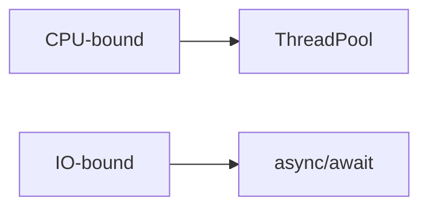

---
title: Thread / Task / Async Runtime
sidebar:
  order: 9
---

> CPU-bound / IO-bound 구분이 되는가

이 구분이 안 되면 비동기 설계 대화는 바로 막힌다.

---

## 기본 개념

* **Thread**: OS가 관리하는 실행 단위
* **Task**: 작업 단위 추상화 (.NET)
* **async/await**: 비동기 흐름 표현 문법

---

## CPU-bound vs IO-bound

* CPU-bound: 계산 자체가 무거움 → 병렬 처리 필요
* IO-bound: 대기 시간이 김 → async로 효율화

---

## Unity 관점 패턴

* 백그라운드: 파싱, 압축, 암호화
* 메인 스레드: Unity API 접근

---

## 대화용 한 문장

> "IO 대기는 async로 숨기고, CPU 연산은 별도 작업으로 분리합니다."
