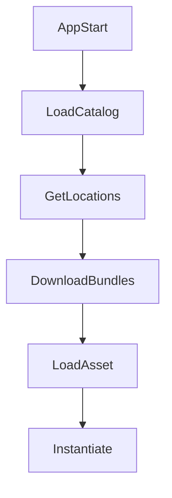

---
title: Addressables Analysis
---

[Addressables Document](https://docs.unity3d.com/Packages/com.unity.addressables@2.3/manual/index.html)

# Why use it?

## Limits of the Resources workflow
- `Resources.Load` offers no practical memory management, so every resource ends up in memory at runtime.
- All resources are included in the build, which increases the initial build size.
- Updates require redistributing the app.

## Core ideas behind Addressables

| Item | Meaning |
|-------------|------------------------------------------------------------------------------------------------------------------------------|
| Lazy Loading | - Loads resources only when needed to save memory. - Bundles can be split and loaded like DLC. |
| Catalog-based | - Manages remote bundle structure through metadata called a Catalog. - The catalog is represented as JSON and is handled automatically by Addressables. - Individual files can also be versioned, checked, and downloaded independently. |
| CDN integration | - Works with CDNs such as Firebase, GCS, S3, and Cloudflare. |

## Overall Addressables flow

| Concept | Description |
|----------|---------------------------|
| Catalog  | Mapping information from Address to Bundle |
| Bundle   | A package-like unit that groups actual assets |
| Provider | Loading strategy (Local / Remote) |

## LoadAsync and InstantiateAsync

When you access the same prefab using the following methods...
### 3.1 Difference between LoadAssetAsync and InstantiateAsync

| Item | LoadAssetAsync | InstantiateAsync |
|--------|------------------|-------------------|
| Return type | Original asset (Prefab, Sprite, ScriptableObject, etc.) | GameObject instance placed in the scene |
| Creates GameObject | ❌ No | ✅ Immediately |
| Dependency loading | ✅ Loads related bundles | ✅ Loads related bundles |
| When it becomes usable | Only the asset reference is available; you still need Instantiate | Ready to use immediately in an active state |
| Memory usage | Occupies asset memory only | Occupies asset + instance memory |
| Pooling integration | Requires manual Instantiate + pool setup | Can return the instance directly to a pool |
| Reuse strategy | The same asset can be instantiated many times | Reusing instances is more common |
| Release target | Focused on releasing the asset handle | Must manage both the instance and the asset handle |
| Addressables.Release | Mainly for asset lifetime management | Requires `ReleaseInstance` after returning the instance |
| Performance for many spawns | Instantiate cost still exists | Same, because Instantiate is performed internally |
| Suitable for UI / Popup | ❌ Inconvenient | ✅ Very suitable |
| Suitable for data assets | ✅ Good for ScriptableObject and config loading | ❌ Not appropriate |
| Common pitfall | Releasing only the asset while keeping instance references alive | Releasing the handle while the pooled instance is still in use can break things |
