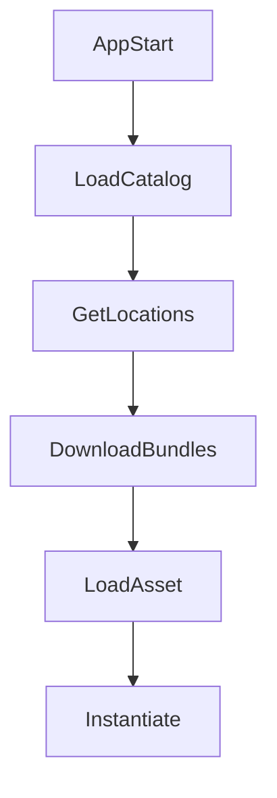

---
title: Addressables 分析
---

[Addressables Document](https://docs.unity3d.com/Packages/com.unity.addressables@2.3/manual/index.html)

# なぜ使うのか？

## Resources 方式の限界
- `Resources.Load` では実質的なメモリ管理ができず、すべてのリソースがランタイム時にメモリへ載ります。
- すべてのリソースがビルドに含まれるため、初回ビルドサイズが大きくなります。
- 更新のたびにアプリを再配布する必要があります。

## Addressables の核心

| 項目 | 意味 |
|-------------|------------------------------------------------------------------------------------------------------------------------------|
| Lazy Loading | - 必要なタイミングでのみリソースを読み込み、メモリを節約します。 - DLC のようにバンドル単位で分けてロードできます。 |
| Catalog ベース | - リモートバンドル構成を Catalog というメタデータで管理します。 - catalog は JSON 形式で実装され、Addressables 側で自動的に処理されます。 - 個別ファイル単位でもバージョン管理、チェック、ダウンロードが可能です。 |
| CDN 連携 | - Firebase、GCS、S3、Cloudflare などの CDN を利用できます。 |

## Addressables の全体フロー

| 概念 | 説明 |
|----------|---------------------------|
| Catalog  | Address -> Bundle の対応情報 |
| Bundle   | 実際の Asset をまとめたパッケージ単位 |
| Provider | 読み込み方式（Local / Remote） |

## LoadAsync と InstantiateAsync

同じ Prefab を次の方法で呼び出した場合...
### 3.1 LoadAssetAsync と InstantiateAsync の違い

| 項目 | LoadAssetAsync | InstantiateAsync |
|--------|------------------|-------------------|
| 戻り値 | 元の Asset（Prefab、Sprite、ScriptableObject など） | シーン上に配置された GameObject インスタンス |
| GameObject 生成 | ❌ しない | ✅ すぐに生成 |
| 依存ロード | ✅ 関連バンドルをロード | ✅ 関連バンドルをロード |
| 実際に使えるタイミング | Asset 参照のみ。Instantiate が別途必要 | そのままアクティブ状態で利用可能 |
| メモリ使用量 | Asset 分のみ | Asset + Instance 分 |
| Pooling 連携 | 自前で Instantiate + Pool 構成が必要 | そのままプールへ返却可能 |
| 再利用戦略 | 同じ Asset を何度も Instantiate できる | Instance 再利用が一般的 |
| Release 対象 | Asset Handle の解放 | Instance と Asset Handle の両方を管理する必要あり |
| Addressables.Release | Asset の寿命管理が中心 | インスタンス返却後に `ReleaseInstance` が必要 |
| 大量生成時の性能 | Instantiate コストは発生 | 同等。内部で Instantiate を行うため |
| UI / Popup との相性 | ❌ 手間がかかる | ✅ 非常に相性が良い |
| Data Asset への適性 | ✅ ScriptableObject や設定読込に向く | ❌ 不向き |
| ミスしやすい点 | Asset だけ Release して Instance 参照を残してしまう | プールに戻したまま Handle を Release すると壊れる |
